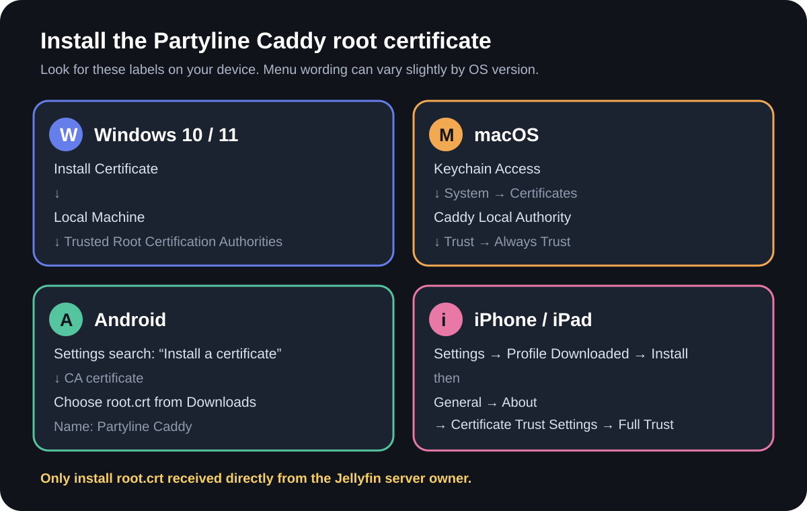

# Install `root.crt` for Jellyfin Partyline

You should have received this guide together with a file named `root.crt`. Install that file once on the device you will use to watch Jellyfin.



> **Only continue if the owner sent you the certificate.** Installing a root certificate changes which secure websites your device trusts. Do not install a similarly named file from anyone else.

## Check that you have the correct file

- File name: `root.crt`
- Certificate name after opening it: **Caddy Local Authority - 2026 ECC Root**
- SHA-256 checksum of the `root.crt` file:

```text
933A975D396B92E713382D3467E9ADCA630D8EE73DCBB0A594238008D56AABA0
```

- SHA-256 fingerprint shown by certificate tools:

```text
7078D3982944DA33A06645F308FD53755FF5992257E5CEE4F5DC325A77C1AFB8
```

Choose your device below and follow every step.

## Windows 10 or Windows 11

1. Save `root.crt` to the computer.
2. Double-click `root.crt` to open **Certificate Information**.
3. Click **Install Certificate**.
4. Select **Local Machine**, click **Next**, then approve the administrator prompt.
   - If you do not have administrator access, select **Current User** instead. The certificate will apply only to your Windows account.
5. Select **Place all certificates in the following store**.
6. Click **Browse**.
7. Select **Trusted Root Certification Authorities**, then click **OK**.
8. Click **Next** → **Finish**.
9. If a **Security Warning** asks whether to install the certificate, confirm only after checking that its name matches the one above.
10. Wait for **The import was successful**, then click **OK**.
11. Completely restart your browser. Chrome users can enter `chrome://restart` in the address bar.

If the warning remains in Chrome or Edge, press `Win` + `R`, enter `inetcpl.cpl`, and select **Content** → **Clear SSL state**. Then restart the browser again.

## Mac

These steps use Apple’s **Keychain Access** app.

1. Save `root.crt` to **Downloads**.
2. Press `Command` + `Space`, type **Keychain Access**, then press `Return`.
3. In the left sidebar, select the **System** keychain.
4. Open **Finder** → **Downloads**, then drag `root.crt` into the Keychain Access window.
5. Enter the Mac administrator name and password if asked.
6. In Keychain Access, select **System** → **Certificates**.
7. Find and double-click **Caddy Local Authority - 2026 ECC Root**.
8. Expand the **Trust** section.
9. Change **When using this certificate** to **Always Trust**.
10. Close the certificate window.
11. Enter the administrator password or use Touch ID to save the change.
12. Completely quit the browser with `Command` + `Q`, then reopen it.

Apple’s official instructions show the same [certificate import](https://support.apple.com/guide/keychain-access/kyca2431/mac) and [trust settings](https://support.apple.com/guide/keychain-access/kyca11871/mac).

## Android phone or tablet

First save `root.crt` in the device’s **Downloads** folder. The exact menu path depends on the manufacturer.

### Google Pixel and stock Android

1. Open **Settings**.
2. Tap **Security & privacy**.
3. Tap **More security settings**.
4. Tap **Encryption & credentials**.
5. Tap **Install a certificate**.
6. Tap **CA certificate**. Do not choose **Wi-Fi certificate** or **VPN & app user certificate**.
7. Read the warning, then tap **Install anyway**.
8. Enter the device PIN, pattern, or password.
9. Open **Downloads** and select `root.crt`.
10. If asked for a certificate name, enter **Partyline Caddy**, then tap **OK**.
11. Completely close and reopen Chrome.

### Samsung Galaxy

1. Open **Settings**.
2. Tap **Security and privacy**.
3. Tap **More security settings**.
4. Tap **Install from device storage**.
5. Tap **CA certificate**. Do not choose a Wi-Fi or user certificate option.
6. Read the warning, then tap **Install anyway**.
7. Enter the device PIN, pattern, or password.
8. Open **Downloads** and select `root.crt`.
9. If asked for a certificate name, enter **Partyline Caddy**, then tap **OK**.
10. Completely close and reopen Chrome.

If your Android menus differ, open **Settings** and search for **CA certificate** or **Install a certificate**. Google’s official Android instructions include [screenshots for both Pixel and Samsung paths](https://support.google.com/device-usage-study-help/answer/15713321?co=GENIE.Platform%3DAndroid&hl=en).

Android may display **Network may be monitored** after installing a private CA certificate. This is the expected Android warning for any user-installed CA; it does not mean someone is currently monitoring the phone. Samsung explains this behavior in its [Knox documentation](https://docs.samsungknox.com/admin/knox-platform-for-enterprise/kbas/kba-115013363628/).

## iPhone or iPad

Apple requires two separate stages: install the certificate profile, then enable full trust.

### Stage 1: install the profile

1. Tap the `root.crt` attachment or download link in **Mail** or **Safari**.
2. When iOS says **Profile Downloaded**, tap **Close**.
3. Open **Settings** within eight minutes of downloading the file.
4. Tap **Profile Downloaded** beneath your Apple Account name.
   - If it is not shown, open **General** → **VPN & Device Management**, then select the downloaded profile.
5. Tap **Install** in the upper-right corner.
6. Enter the device passcode.
7. Read the warning, then tap **Install** again.
8. Tap **Done**.

If the profile disappears before you install it, open `root.crt` again and repeat these steps. Apple deletes an uninstalled downloaded profile after eight minutes.

### Stage 2: enable full trust

1. Open **Settings**.
2. Tap **General**.
3. Tap **About**.
4. Scroll to the bottom and tap **Certificate Trust Settings**.
5. Under **Enable Full Trust for Root Certificates**, turn on **Caddy Local Authority - 2026 ECC Root**.
6. Tap **Continue** to confirm.
7. Completely close and reopen Safari or Chrome.

Apple provides screenshots for [installing a downloaded profile](https://support.apple.com/102400) and confirms the separate [Enable Full Trust](https://support.apple.com/102390) step.

## Open Jellyfin

Connect to the appropriate network, then use one of these exact addresses:

- While connected to the apartment Wi-Fi: <https://192.168.1.53>
- While connected through Tailscale: <https://100.81.99.21>
- Tailscale hostname: <https://tailscale-name.ts.net>

The address must begin with `https://`. Do not add `:8096`.

The installation worked if Jellyfin opens without a full-page certificate warning or a **Not secure** message. Sign in normally; Partyline voice should then be available.

## If the browser still says it is unsafe

1. Check that the address begins with `https://`, not `http://`.
2. Check that you used one of the exact addresses above without `:8096`.
3. Restart the entire browser, not only the tab.
4. Confirm that the certificate was installed as a **trusted root** or **CA certificate**.
5. Send the owner a screenshot of the warning, including its error code if one is shown.

Do not use the browser’s option to bypass the warning. The certificate must be trusted properly for microphone access to work reliably.

## Remove the certificate later

- **Windows:** search for **Manage computer certificates** → **Trusted Root Certification Authorities** → **Certificates** → delete **Caddy Local Authority - 2026 ECC Root**.
- **Mac:** open **Keychain Access** → **System** → **Certificates** → delete **Caddy Local Authority - 2026 ECC Root**.
- **Pixel/stock Android:** **Settings** → **Security & privacy** → **More security settings** → **Encryption & credentials** → **User credentials** → select and remove the certificate.
- **Samsung Galaxy:** **Settings** → **Security and privacy** → **More security settings** → **User certificates** → select and remove the certificate.
- **iPhone/iPad:** **Settings** → **General** → **VPN & Device Management** → select the profile → **Remove Profile**.

